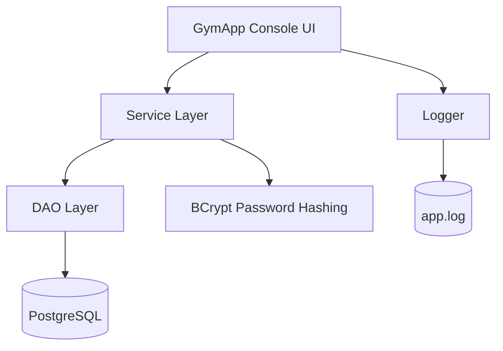
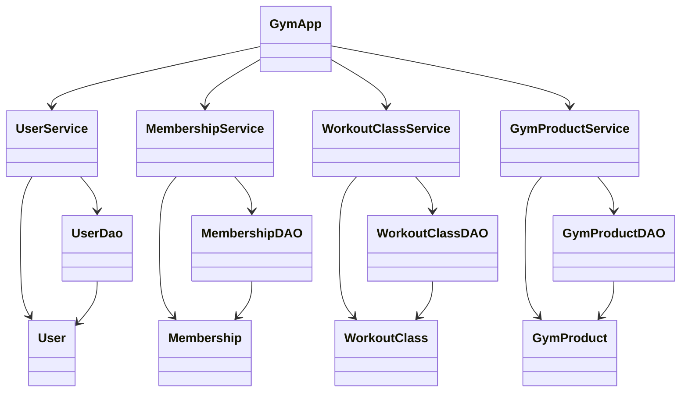

# TECHNICAL DOCUMENTATION

## 1. Architecture Overview
The application uses a simple layered design:

- **Console UI**: `GymApp` handles menus, login prompts, and user input.
- **Service layer**: `UserService`, `MembershipService`, `WorkoutClassService`, and `GymProductService` contain business logic and validation steps like password hashing.
- **DAO layer**: `UserDao`, `MembershipDAO`, `WorkoutClassDAO`, and `GymProductDAO` handle SQL queries and database access.
- **Database**: PostgreSQL stores users, memberships, workout classes, and merchandise.



## 2. Class Design
The project follows a model/service/DAO structure.

### Core Models
- `User` stores username, password, email, phone number, address, and role.
- `Membership` stores membership type, price, member ID, and purchase date.
- `WorkoutClass` stores class name, description, trainer ID, and schedule.
- `GymProduct` stores product name, product type, price, and stock level.

### Service Classes
- `UserService` hashes passwords with BCrypt, registers users, logs users in, lists users, and deletes users.
- `MembershipService` adds memberships, retrieves a member’s membership, and gets total revenue.
- `WorkoutClassService` creates classes, lists all classes, lists classes by trainer, deletes classes, and updates classes.
- `GymProductService` adds products and lists all products.

### DAO Classes
- `UserDao` runs SQL for registering users, finding users by username, viewing all users, and deleting users.
- `MembershipDAO` inserts memberships, gets a membership by member ID, and sums membership revenue.
- `WorkoutClassDAO` inserts classes, lists classes, filters classes by trainer, deletes classes, and updates classes.
- `GymProductDAO` inserts merchandise and lists all merchandise.

### Simple Class Diagram


## 3. Database Design
The system uses four PostgreSQL tables.

### `users`
- `id` SERIAL PRIMARY KEY
- `username` VARCHAR(50) UNIQUE NOT NULL
- `password` VARCHAR(255) NOT NULL
- `email` VARCHAR(100) UNIQUE NOT NULL
- `phone` VARCHAR(20)
- `address` VARCHAR(255)
- `role` VARCHAR(20) NOT NULL

### `memberships`
- `id` SERIAL PRIMARY KEY
- `membership_type` VARCHAR(50) NOT NULL
- `price` DECIMAL(10,2) NOT NULL
- `member_id` INT REFERENCES users(id) ON DELETE CASCADE
- `purchase_date` DATE DEFAULT CURRENT_DATE

### `workout_classes`
- `id` SERIAL PRIMARY KEY
- `class_name` VARCHAR(100) NOT NULL
- `description` TEXT
- `trainer_id` INT REFERENCES users(id) ON DELETE SET NULL
- `schedule` VARCHAR(100)

### `gym_merch`
- `id` SERIAL PRIMARY KEY
- `product_name` VARCHAR(100) NOT NULL
- `product_type` VARCHAR(50)
- `price` DECIMAL(10,2) NOT NULL
- `stock_level` INT DEFAULT 0

### Relationship Summary
- One user can have one membership record per purchase.
- One trainer can be linked to many workout classes.
- Merchandise is stored separately from users and memberships.

## 4. Setup Instructions
1. Clone the repository.
2. Make sure Java 25 or newer is installed.
3. Make sure PostgreSQL is running locally.
4. Create a database named `gymdb`.
5. Run the SQL script in `src/main/resources/scripts.sql` to create the tables.
6. Confirm the PostgreSQL credentials in `DatabaseConnection.java` match your local setup.
7. Build the project with Maven.
8. Run `GymApp` from the main class in the `org.keyin` package.

### Example run command
```bash
mvn clean compile exec:java -Dexec.mainClass=org.keyin.GymApp
```

## 5. Dependencies
The project uses two Maven dependencies.

- **PostgreSQL JDBC driver** (`org.postgresql:postgresql:42.7.12`) - connects Java to PostgreSQL.
- **jBCrypt** (`org.mindrot:jbcrypt:0.4`) - hashes and verifies passwords.

The project also uses built-in Java libraries for:
- `Scanner` for console input
- `Logger`, `FileHandler`, and `SimpleFormatter` for logging
- `java.sql` for database access

## 6. Logging Setup
Logging is configured in `GymApp` using `java.util.logging`.

- Logs are written to `app.log` in the project root.
- A `FileHandler` appends to the log file so logs are preserved between runs.
- A `SimpleFormatter` keeps the log file easy to read.

### Logged events
- System startup
- Failed login attempts
- Database transaction errors
- Admin overrides such as deleting a user

### Why logging is used
Logging is better than console output for important events because it keeps a permanent record. That makes it easier to debug the app and review what happened after a problem or admin action.

## 7. Notes About the Codebase
- `GymApp` is the main entry point and contains the role-based menus.
- `CustomLogger` exists as a scaffold in the repo, but the working logger is implemented directly in `GymApp`.
- The app is console-based, so all interactions happen through menu prompts.
